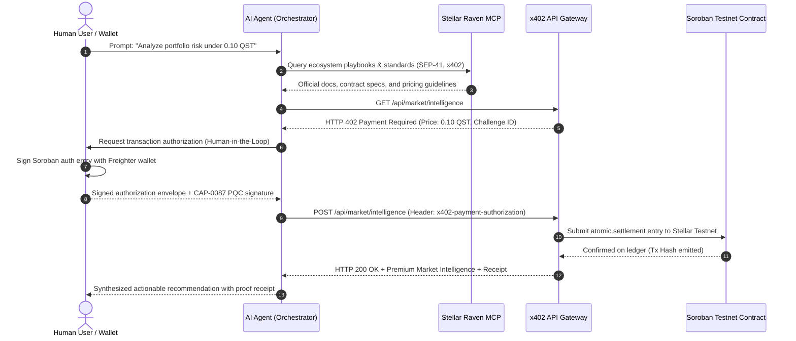

# 📐 QSTELLAR — System Architecture & Specification

## Executive Overview
**QSTELLAR** is a privacy-aware, post-quantum-ready AI agentic finance platform built on the Stellar network. It provides an autonomous economic coordination layer where humans and software agents discover services, authenticate with wallets, execute programmable payments via HTTP 402, and settle transactions with cryptographic finality on Soroban smart contracts.

---

## High-Level Architecture Diagram

```
+-------------------------------------------------------------------------+
|                         HUMAN INTERFACE LAYER                           |
|       Next.js / Vite React Web Console  |  Mobile PWA  |  QR Station    |
+------------------------------------+------------------------------------+
                                     |
                                     v
+-------------------------------------------------------------------------+
|                      MULTI-MODEL AI AGENT LAYER                         |
|   Claude 3.5 Sonnet | GPT-4o | Gemini 2.0 | DeepSeek | Qstellar Engine  |
|                                                                         |
|   Tool Routing:                                                         |
|   ├── Stellar Raven Remote MCP (raven.stellar.org/mcp)                  |
|   ├── x402 Micropayment Client (HTTP 402 Challenge Handler)             |
|   └── PQC Hybrid Verifier (CAP-0087 / ML-DSA-65)                        |
+------------------------------------+------------------------------------+
                                     |
                                     v
+-------------------------------------------------------------------------+
|                     x402 BAZAAR PROTOCOL GATEWAY                        |
|   HTTP 402 Payment Required  |  Facilitator Node  |  Settlement Relay   |
+------------------------------------+------------------------------------+
                                     |
                                     v
+-------------------------------------------------------------------------+
|                        STELLAR WALLET LAYER                             |
|    Freighter | xBull | Lobstr | Albedo | WalletConnect | Dev Account    |
|    * Strict Rule: Client-Side User Authorization Only                   |
+------------------------------------+------------------------------------+
                                     |
                                     v
+-------------------------------------------------------------------------+
|                  SOROBAN SMART CONTRACTS LAYER (RUST)                   |
|   +--------------------+  +--------------------+  +------------------+  |
|   |   qstellar-token   |  |   agent-payment    |  | service-registry |  |
|   |  (SEP-41 Standard) |  |   (x402 Escrow)    |  | (API Discovery)  |  |
|   +--------------------+  +--------------------+  +------------------+  |
|   +------------------------------------------------------------------+  |
|   |              pqc-verifier (CAP-0087 ML-DSA-65)                   |  |
|   +------------------------------------------------------------------+  |
+------------------------------------+------------------------------------+
                                     |
                                     v
+-------------------------------------------------------------------------+
|                       STELLAR TESTNET / PROTOCOL                        |
|           Horizon RPC  |  Soroban RPC  |  SDF Friendbot Faucet          |
+-------------------------------------------------------------------------+
```

---

## End-to-End Execution Sequence



---

## Core Subsystems

### 1. Stellar Raven Remote MCP Client (`@qstellar/raven-mcp`)
- Connects directly to the official SDF remote MCP server at `https://raven.stellar.org/mcp`.
- Bridged via `mcp-remote` with `--transport http-only` for compatibility with any LLM client:
  ```json
  {
    "mcpServers": {
      "stellar-raven": {
        "command": "npx",
        "args": ["-y", "mcp-remote@latest", "https://raven.stellar.org/mcp", "--transport", "http-only"]
      }
    }
  }
  ```
- Exposes `search` and `execute` across 21 ecosystem skills (Lumenloop, OpenZeppelin, Stellar Dev, Scout).

### 2. x402 Bazaar Protocol (`@qstellar/x402-bazaar`)
- Native implementation of HTTP 402 Payment Required status code.
- Soroban authorization entries allow atomic fee payments in QST or USDC.
- Sub-5 second settlement latency on Stellar Testnet.

### 3. Post-Quantum Cryptography (`@qstellar/pqc-crypto`)
- Direct alignment with Stellar Protocol **CAP-0087** ("Host functions for ML-DSA signature verification").
- NIST FIPS 204 Parameter Set 65:
  - Public Key: **1,952 bytes**
  - Secret Key: **4,032 bytes**
  - Signature: **3,309 bytes**
  - Security Category: NIST Level 3 (AES-192 equivalent).
- Dual-layer hybrid authorization (Ed25519 + ML-DSA-65).

### 4. Conway Automaton Engine (`@qstellar/conway-automaton`)
- Cellular automaton modeling decentralized agent economics.
- States:
  - `0`: DEAD / OFFLINE
  - `1`: IDLE (Awaiting task)
  - `2`: ACTIVE (Processing intent)
  - `3`: PAYING (Executing x402 micropayment)
  - `4`: VERIFYING (Validating PQC / ZK proof)
  - `5`: FAILED (Gas exhaustion / signature rejected)
- Real-time HTML5 Canvas telemetry.

### 5. Zero-Knowledge Selective Privacy (`@qstellar/privacy-zk`)
- Groth16 proof system over BN254 elliptic curve.
- Poseidon2 sponge hash function for cryptographic commitments.
- Proves KYC compliance tier and balance threshold without exposing PII.
